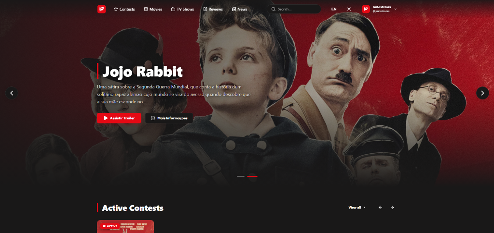

# Antestreias — Gestor e Portal de Cinema



O **Antestreias** é uma plataforma e portal de cinema premium concebida para a publicação de antestreias, passatempos, notícias do mundo cinematográfico, críticas de utilizadores e trailers de vídeo. Conta com uma arquitetura moderna dividida, segurança avançada, otimização de base de dados e um sistema robusto de logs e alertas automáticos de erros.

---

## 🚀 Funcionalidades Principais

* **Frontend Moderno e Reativo:** Desenvolvido em React com TypeScript, empacotado pelo Vite, proporcionando carregamentos instantâneos e transições fluidas.
* **API de Alto Rendimento:** Backend estruturado em PHP puro ligando à base de dados MySQL via PDO.
* **Gestão de Passatempos (Contests):** Sistema de participação e registo de vencedores com formulários interativos.
* **Comentários e Críticas:** Secção de avaliações de filmes por utilizadores com controlo de moderação e perfis de utilizador.
* **Segurança e Higienização Global:**
  * **Rate Limiting:** Proteção ativa contra ataques de brute-force e flood (máximo 5 acessos/15m para rotas de autenticação, e 100 acessos/1m para rotas gerais).
  * **Sanitização de Inputs:** Interceção automática em stream do payload JSON para limpeza de caracteres nulos e injeções de scripts maliciosos (XSS).
* **Pipeline de Alertas e Log de Erros:** Interceção global de erros graves ou crashes (PHP e React) enviando avisos de e-mail automatizados em tempo real aos administradores com throttling anti-spam.
* **Recuperação de Conta Segura:** Fluxo de redefinição de palavra-passe com tokens criptográficos expirados (1 hora de validade).

---

## 📁 Arquitetura do Projeto

O repositório está dividido de forma limpa e organizada:

```text
antestreias/v2/
├── backend/            # API e lógica de negócio em PHP
│   ├── database/       # Ficheiros SQL e migrações (schema.sql)
│   ├── includes/       # Bibliotecas de terceiros (PHPMailer, etc.)
│   ├── .env            # Ficheiro de variáveis de ambiente
│   ├── db.php          # Ligação à base de dados MySQL (PDO)
│   ├── headers.php     # Validação de segurança, CORS e Rate Limits
│   └── error_handler.php # Interceção global de exceções e alertas de e-mail
├── frontend/           # Aplicação do Cliente em React (Vite)
│   ├── src/            # Componentes, Páginas, Hooks e Contextos
│   ├── public/         # Ficheiros estáticos e manifesto PWA
│   ├── vite.config.ts  # Configuração de compilação do Vite
│   └── package.json    # Dependências do ecossistema React
├── uploads/            # Pasta física de uploads (imagem de capas, avatares)
├── package.json        # Script proxy para correr comandos de raiz
└── README.md           # Documentação do projeto
```

---

## 🛠️ Configuração e Instalação Local

### Requisitos Prévios
* **Servidor Web Local:** XAMPP, WampServer ou Laragon (com suporte para **PHP 8.0+** e **MySQL**).
* **Gestor de Pacotes:** Node.js (versão 18+) e NPM instalados.

### 1. Configurar a Base de Dados
1. Abre o **phpMyAdmin** ou o teu gestor de SQL favorito.
2. Cria uma nova base de dados chamada `antestre_db`.
3. Importa o ficheiro SQL contido em:
   ```text
   backend/database/schema.sql
   ```

### 2. Configurar o Backend
1. Acede à pasta `backend/`.
2. Cria ou edita o ficheiro `.env` definindo as credenciais da base de dados e do servidor SMTP (se aplicável):
   ```ini
   DB_HOST=localhost
   DB_NAME=antestre_db
   DB_USER=root
   DB_PASS=
   ```

### 3. Instalação e Execução (Vite Dev Server)
Para facilitar o desenvolvimento, podes correr comandos diretamente na raiz do projeto:

1. **Instalar dependências do frontend:**
   ```bash
   npm install --prefix frontend
   ```
2. **Iniciar o servidor de desenvolvimento:**
   ```bash
   npm run dev
   ```
   *O teu portal estará acessível em `http://localhost:5173`.*

3. **Compilar para produção:**
   ```bash
   npm run build
   ```
   *Os ficheiros otimizados serão gerados em `frontend/dist/`.*

---

## 🧑‍💻 Autores e Contribuição

Desenvolvido por [rsoliveirapt](https://github.com/rsoliveirapt). Sente-se à vontade para abrir Issues e Pull Requests para melhorias no portal de antestreias!
