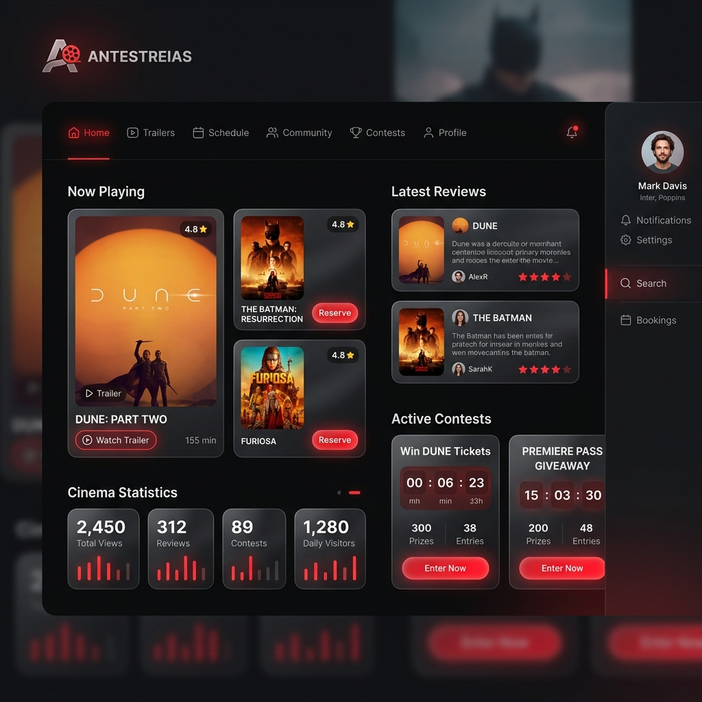

# Antestreias — Gestor e Portal de Cinema

O **Antestreias** é uma plataforma e portal de cinema concebido para a publicação de antestreias, gestão de passatempos, agregação de notícias do mundo cinematográfico, e partilha de críticas e trailers. A plataforma oferece uma experiência altamente interativa para cinéfilos, combinando um design moderno e responsivo com um backoffice administrativo poderoso.

---

## ✨ Funcionalidades em Destaque

### 🎬 Experiência Cinematográfica Premium
* **Design Imersivo:** Layout moderno com tema Dark e Light, focado na estética dos cinemas, com transições suaves, e design responsivo adaptado a dispositivos móveis.
* **Sliders Dinâmicos:** Carrosséis interativos que destacam os últimos lançamentos, trailers e notícias em destaque na página inicial.
* **Fichas de Filmes Completas:** Detalhes de elenco, país de produção, trailers oficiais, géneros e críticas associadas.

### 🎁 Passatempos & Antestreias
* **Formulários de Participação:** Utilizadores podem habilitar-se a ganhar convites duplos selecionando o local de exibição (ex: cinemas de Lisboa ou Porto).
* **Gestão de Vencedores:** Painel administrativo completo para visualizar participações, exportar listas de participantes e sortear/definir vencedores de forma organizada.

### 💬 Comunidade
* **Perfis de Utilizador:** Cada membro tem um perfil personalizado onde pode visualizar o seu histórico, seguir outros utilizadores e gerir as suas avaliações.
* **Sistema de Avaliação por Estrelas:** Críticas detalhadas de filmes e séries, com notas de 1 a 10 estrelas.

### 🌐 Integração Externa & Notícias
* **Sincronização TMDB (The Movie Database):** Importação automática de metadados, posters, elencos e detalhes de filmes diretamente da API do TMDB.
* **Agregador de Notícias:** Importação automática de feeds de notícias para manter o portal sempre atualizado com o mundo do espetáculo.

### 📱 Aplicação Web Progressiva (PWA)
* **Instalável no Telemóvel:** Suporte completo para PWA, permitindo aos utilizadores adicionar o portal ao ecrã inicial como se fosse uma app nativa.
* **Notificações Push:** Envio de alertas de passatempos diretamente para os dispositivos dos utilizadores através do painel de administração.

---

## 🛠️ Tecnologias Utilizadas

### Frontend (Aplicação do Cliente)
* **React 18 & TypeScript:** Código robusto, modular e tipado para máxima estabilidade.
* **Vite:** Empacotador de última geração para desenvolvimento ultrarrápido e compilação otimizada.
* **CSS Customizado:** Estilos otimizados e harmoniosos com animações modernas e suporte para temas.
* **Lucide Icons:** Biblioteca de ícones modernos e minimalistas.

### Backend (API & Serviço)
* **PHP 8.2 (PDO):** Conexão rápida, segura e preparada contra injeções SQL.
* **PHPMailer (SMTP/SSL):** Envio fiável de e-mails transacionais (como recuperação de palavra-passe e confirmação de participação).
* **Painel Administrativo:** Backoffice completo para controlo de definições, aparência de e-mails, anúncios (Ads), estatísticas de visitas e logs de atividade.

---

## 🧑‍💻 Autor

Desenvolvido com dedicação por [rsoliveirapt](https://github.com/rsoliveirapt).
